# Comparison of classification results of selected rule-based methods

- [Introduction](#introduction)
- [Algorithms and parameters](#algorithms-and-parameters)
  - [Selected rule-based methods](#selected-rule-based-methods)
  - [RuleKit parameters](#rulekit-parameters)
- [Datasets](#datasets)
  - [*UCI* datasets statistics](#uci-datasets-statistics)
  - [*BIG sets* datasets statistics](#big-sets-datasets-statistics)
- [Results](#results)
  - [Number of classification results not
    obtained](#number-of-classification-results-not-obtained)
  - [Accuracy (ACC) of the prediction on the test
    dataset](#accuracy-acc-of-the-prediction-on-the-test-dataset)
  - [Accuracy (ACC) of the prediction on the train
    dataset](#accuracy-acc-of-the-prediction-on-the-train-dataset)
  - [Balanced accuracy (BAcc) on the test
    dataset](#balanced-accuracy-bacc-on-the-test-dataset)
  - [Balanced accuracy (BAcc) on the train
    dataset](#balanced-accuracy-bacc-on-the-train-dataset)
  - [Calculation time](#calculation-time)
  - [Number of rules](#number-of-rules)
  - [Total number of conditions](#total-number-of-conditions)
  - [Discussion](#discussion)
- [Comparison of RuleKit and
  MLRules](#comparison-of-rulekit-and-mlrules)
  - [Results for *UCI* datasets](#results-for-uci-datasets)
  - [Results for *BIG sets* datasets](#results-for-big-sets-datasets)
  - [Discussion](#discussion-1)
- [RuleKit - maximum number of
  rules](#rulekit---maximum-number-of-rules)
  - [ACC on test dataset](#acc-on-test-dataset)
  - [BAcc on test dataset](#bacc-on-test-dataset)
  - [Calculation time](#calculation-time-1)
  - [Discussion](#discussion-2)
- [Summary](#summary)

# Introduction

The report summarises the results of comparative experiments of selected
rule-based methods used for classification problems. One of its most
important goals was to see how our algorithm for rule induction –
RuleKit – performs compared to other methods. The given comparison is
also relevant in the context of the RuleMiner platform we are developing
based on the RuleKit system. This analytical platform helps to create
rule-based knowledge discovery and predictive models easily.

# Algorithms and parameters

A selection of rule-based methods was used in the study. The algorithms
under examination employ a range of approaches to rule induction,
including covering strategy, object-related, and ensemble methods. This
deliberate selection aimed to test diverse algorithm types. We have
chosen solutions known for their quality – often deemed the best in
published works – and for which high-quality code or executable versions
of rule induction programs are accessible.

The following section describes the methods in question and provides
information on the run parameters used. It also indicates the labels
that appear in the respective report for the selected method
configuration.

## Selected rule-based methods

Below is a description of the methods used.

### AQ15

`AQ15` is a rule-based algorithm derived from the Rseslib package. The
code for this tool can be found in the [Rseslib
repository](https://github.com/awojna/Rseslib). When running this
algorithm, its default parameters were used. A description of the
algorithm can be found in
[documentation](https://rseslib.mimuw.edu.pl/rseslib.pdf).

Important note: to run the classification using AQ15, an implementation
of Rseslib was used, which takes into account a fix published in the
repository ([commit
75e4bb0](https://github.com/awojna/Rseslib/commit/75e4bb05f3cd17867666a38884a52446aac3ac84)).
The provided fix was not incorporated into the official version, v3.3.1,
at the time of generating this report. Despite this correction,
classification results using the AQ15 algorithm were still unavailable
for some datasets. The time constraints were implemented to address this
issue: calculations exceeding 3 hours for small and 48 hours for large
datasets were forcibly terminated, resulting in empty classification
results. During subsequent ranking and CD diagram creation for methods,
the highest rank was attributed to such cases. This approach ensured
that the algorithm in question could be included in the rankings but was
“penalized” for not receiving a result for specific datasets.

### BRCG

`BRCG` - Boolean Decision Rules via Column Generation, sometimes the
name ‘CG’ is used. An article describing the method can be found here:
[Boolean Decision Rules via Column
Generation](https://proceedings.neurips.cc/paper_files/paper/2018/file/743394beff4b1282ba735e5e3723ed74-Paper.pdf),
while an implementation is available in the AIX360 GitHub repository:
[AIX360](https://github.com/Trusted-AI/AIX360/blob/master/aix360/algorithms/rbm/boolean_rule_cg.py).

The method was run with default parameters. The BRCG algorithm only
works for binary classification problems and requires missing values to
be filled in. Missing data were filled in with the most frequent value
in the column (for nominal attributes) or the average value (for numeric
attributes).

### CN2

The algorithm is from the Orange package, method
[cn2ruleinduction](https://orangedatamining.com/widget-catalog/model/cn2ruleinduction/).
The CN2 algorithm was run in two versions of the parameter settings.

- `CN2_default` - CN2 method running with default parameters
  (“min_covered_examples”: 1, “max_rule_length”: 5,
  “constrain_continuous”: True, “beam_width”: 5). A description of the
  set parameters is as follows:

  - min_covered_examples - *found rules must cover at least the minimum
    required number of covered examples. Unordered rules must cover this
    many target class examples.*
  - max_rule_length - *found rules may combine at most the maximum
    allowed number of selectors (conditions).*
  - constrain_continuous - *continuous value space is constrained to
    reduce computation time.*
  - beam_width - *remember the best rule found thus far and monitor a
    fixed number of alternatives (the beam).*

- `CN2_v2` - CN2 method run with parameters that match the default
  RuleKit parameters (“min_covered_examples”: 5, “max_rule_length”:
  math.inf, “constrain_continuous”: False, “beam_width”: 1).

### IDS

`IDS` – the IDS (Interpretable Decision Sets) algorithm is described in
the article [Interpretable Decision Sets: A Joint Framework for
Description and
Prediction](https://cs.stanford.edu/people/jure/pubs/interpretable-kdd16.pdf).
The implementation used was [pyIDS](https://github.com/jirifilip/pyIDS),
which is also described in the article [PyIDS - Python Implementation of
Interpretable Decision Sets Algorithm by Lakkaraju et al,
2016](https://nb.vse.cz/~klit01/papers/RuleML_Challenge_IDS.pdf).

To run a given algorithm, missing data values had to be filled in.
Missing data were filled in with the most frequent value in the column
(for nominal attributes) or the average value (for numeric attributes).

IDS was launched with the following parameters:

- *algorithm: SLS* - parameter specifies the algorithm used for
  optimization. The authors of the IDS method propose to use the Smooth
  Local Searc (SLS) algorithm, so it has been set as the default value.
- *rule_cutoff: 50* - number of association rules generated.
- *lambda_array: \[1, 1, 1, 1, 1, 1, 1\]* - These are the 7 meta
  parameters of the algorithm. On the GitHub page of the implementation,
  such values are indicated for the simple IDS model, so they have been
  treated as default parameters. For more advanced experiments, an
  optimization of these parameters should be performed (such a process
  is also described in the IDS article).

### JRip

`JRip` - the algorithm comes from the Weka package. It has been run with
default parameters. After generating the rules, the given algorithm also
returns an empty rule that points to the largest quantitative class and
has no conditions in the premise. For example, if an example does not
meet the rules’ conditions, it will be classified using this empty rule.
In our statistics, the empty rule is not counted towards the final
number of generated rules.

### LORD

`LORD` - a rule-based algorithm that has been implemented to look for a
locally optimal rule for each example. It can run on multiple threads in
parallel. The article on the algorithm is [Efficient learning of large
sets of locally optimal classification
rules](https://link.springer.com/article/10.1007/s10994-022-06290-w).
The implementation can be found in the GitHub repository
[LORD](https://github.com/vqphuynh/LORD). No parameters were set at
runtime. The default parameters of the LORD algorithm are:

- *metric_type: MESTIMATE*
- *metric_argument 0.1*

Important note: LORD was run using a published JAR file and the results
were based on the returned results from the package. LORD does not
return balanced accuracy (BAcc) results for the training and test set
and does not return accuracy (ACC) results for the training set. For
this reason, there are no results for the above metrics for this method.

### MLRules

`MLRules`- Maximum Likelihood Rule Ensembles, algorithm from the Weka
package.

The MLRules package is available as a JAR file that can be downloaded
from <http://www.cs.put.poznan.pl/wkotlowski/software-mlrules.html>.

In the experiments, a Python package based on the Weka package was used:
[mlrules-weka-package](https://github.com/fracpete/mlrules-weka-package).
MLRules was executed with default parameters, generating 100 resulting
rules.

The article is available here:
<http://machinelearning.org/archive/icml2008/papers/362.pdf>.

### OneR

`OneR` - an algorithm from the Weka package.

The OneR algorithm produces a single rule based on the value of one
specific attribute. This rule directs to a particular class depending on
the attribute’s value, allowing for multiple decisions within this one
rule. The result of the OneR algorithm can be seen as a list of
decisions, all determined by a single attribute. To compare the results
of OneR with those of other algorithms, it is considered that the number
of rules generated by OneR is not always equal to ‘1’, but is the number
of decisions indicated by the rule.

### RuleFit

`rulefit` - an implementation of the algorithm can be found in the
package [imodels](https://csinva.io/imodels/rule_set/rule_fit.html), and
an article describing the RuleFit algorithm can be found here:
[Predictive Learning via Rule
Ensembles](https://jerryfriedman.su.domains/ftp/RuleFit.pdf).

RuleFit requires the completion of missing values and only works for
binary classification problems.

### RuleKit

`RuleKit` - the package can be found in the GitHub repository
[RuleKit](https://github.com/adaa-polsl/RuleKit). The exact combinations
of parameters tested are described in the section below. The authors of
the respective report are co-authors of the RuleKit package.

It is worth noting that the `BRCG` and `rulefit` algorithms work only
for binary classification problems. The other algorithms work for binary
and multi-class classification problems.

## RuleKit parameters

The RuleKit algorithm was run with several different parameter
combinations, all of which are indicated below. However, the report will
only present the results for a few selected versions.

Selected parameters were set:

- mincov - values:
  - 5
  - 10% of the number of examples in the smallest class, but not less
    than 5
- measure - values:
  - C2
  - Correlation
- maximum number of rules:
  - 0 (a value of 0 for this parameter means that there was no limit on
    the number of rules)
  - 3
  - 5
  - 10
  - 100
  - 10% of rules generated when there was no limit on the number of
    rules
  - 25% of rules generated when there was no limit on the number of
    rules
  - 50% of rules generated when there was no limit on the number of
    rules

Each combination of these parameters was run. The following labelling of
the parameters was used:

`RuleKit_mincov-<parameter mincov>_measure-<parameter measure>_maxNbRules-<parameter maxNbRules>`.

For example:

- `RuleKit_mincov-5_measure-C2` - it is a label for the experiment that
  specifies that RuleKit was executed with the ‘mincov’ parameter set to
  5, the ‘measure’ parameter set to C2, and without any limitation on
  the number of rules.
- `RuleKit_mincov-10perMinClass_measure-Correlation_maxNbRules-10perOrgRules` -
  it is a label for the experiment that specifies that RuleKit was
  executed with the ‘mincov’ parameter set to 10% of the number of
  examples from the smallest class (but not less than 5), the ‘measure’
  parameter set to Correlation, and the maximum number of rules is 10%
  of the initially generated rules.

# Datasets

Two categories of data were considered in the study - *UCI* datasets,
which are relatively smaller data sets, and *BIG sets*, which are large
datasets. The experiments worked on the basis of 10-fold
cross-validation. Among the datasets analyzed were those with a binary
decision column and those with more than two unique values in the
decision column. This is important because not all algorithms work on
non-binary decision columns (`BRCG` and `rulefit` algorithms work only
for binary classification problems).

The datasets used in the experiments, along with a breakdown for 10-fold
cross-validation, have been made available in a GitHub repository
[ruleminer/datasets](https://github.com/ruleminer/datasets/tree/main/classification).

## *UCI* datasets statistics

Fifty smaller datasets have been analyzed. The table below shows the
characteristics of these datasets.

|     | Dataset                 | Classes | Missing_values | Rows  | Attributes | Numerical_attributes | Nominal_attributes |
|-----|-------------------------|---------|----------------|-------|------------|----------------------|--------------------|
| 0   | anneal                  | 5       | False          | 898   | 38         | 6                    | 32                 |
| 1   | audiology               | 24      | True           | 226   | 69         | 0                    | 69                 |
| 2   | auto-mpg                | 3       | True           | 398   | 7          | 5                    | 2                  |
| 3   | autos                   | 6       | True           | 205   | 25         | 15                   | 10                 |
| 4   | balance-scale           | 3       | False          | 625   | 4          | 4                    | 0                  |
| 5   | breast-cancer           | 2       | True           | 286   | 9          | 0                    | 9                  |
| 6   | breast-w                | 2       | True           | 699   | 9          | 9                    | 0                  |
| 7   | bupa-liver-disorders    | 2       | False          | 345   | 6          | 6                    | 0                  |
| 8   | car                     | 4       | False          | 1728  | 6          | 0                    | 6                  |
| 9   | cleveland               | 5       | True           | 303   | 13         | 6                    | 7                  |
| 10  | contact-lenses          | 3       | False          | 24    | 4          | 0                    | 4                  |
| 11  | credit-a                | 2       | True           | 690   | 15         | 6                    | 9                  |
| 12  | credit-g                | 2       | False          | 1000  | 20         | 7                    | 13                 |
| 13  | cylinder-bands          | 2       | True           | 540   | 35         | 17                   | 18                 |
| 14  | diabetes                | 2       | False          | 768   | 8          | 8                    | 0                  |
| 15  | echocardiogram          | 2       | True           | 131   | 11         | 9                    | 2                  |
| 16  | ecoli                   | 8       | False          | 336   | 7          | 7                    | 0                  |
| 17  | flag                    | 4       | False          | 194   | 28         | 10                   | 18                 |
| 18  | glass                   | 6       | False          | 214   | 9          | 9                    | 0                  |
| 19  | hayes-roth              | 3       | False          | 132   | 4          | 0                    | 4                  |
| 20  | heart-c                 | 2       | True           | 303   | 13         | 6                    | 7                  |
| 21  | heart-statlog           | 2       | False          | 270   | 13         | 13                   | 0                  |
| 22  | hepatitis               | 2       | True           | 155   | 19         | 6                    | 13                 |
| 23  | horse-colic             | 2       | True           | 368   | 22         | 7                    | 15                 |
| 24  | hungarian-heart-disease | 2       | True           | 294   | 13         | 6                    | 7                  |
| 25  | hypothyroid             | 4       | True           | 3772  | 29         | 7                    | 22                 |
| 26  | ionosphere              | 2       | False          | 351   | 34         | 34                   | 0                  |
| 27  | iris                    | 3       | False          | 150   | 4          | 4                    | 0                  |
| 28  | kdd-synthetic-control   | 6       | False          | 600   | 60         | 60                   | 0                  |
| 29  | kr-vs-kp                | 2       | False          | 3196  | 36         | 0                    | 36                 |
| 30  | labor                   | 2       | True           | 57    | 16         | 8                    | 8                  |
| 31  | lymph                   | 4       | False          | 148   | 18         | 3                    | 15                 |
| 32  | mammographic-masses     | 2       | True           | 961   | 5          | 3                    | 2                  |
| 33  | mushroom                | 2       | True           | 8124  | 22         | 0                    | 22                 |
| 34  | pendigits               | 10      | False          | 10992 | 16         | 16                   | 0                  |
| 35  | primary-tumor           | 21      | True           | 339   | 17         | 0                    | 17                 |
| 36  | prnn-synth              | 2       | False          | 250   | 2          | 2                    | 0                  |
| 37  | segment                 | 7       | False          | 2310  | 19         | 19                   | 0                  |
| 38  | seismic-bumps           | 2       | False          | 2584  | 18         | 14                   | 4                  |
| 39  | sick-euthyroid          | 2       | True           | 3772  | 29         | 7                    | 22                 |
| 40  | sonar                   | 2       | False          | 208   | 60         | 60                   | 0                  |
| 41  | soybean                 | 19      | True           | 683   | 35         | 0                    | 35                 |
| 42  | splice                  | 3       | False          | 3190  | 60         | 0                    | 60                 |
| 43  | tic-tac-toe             | 2       | False          | 958   | 9          | 0                    | 9                  |
| 44  | titanic                 | 2       | False          | 2201  | 3          | 0                    | 3                  |
| 45  | vehicle                 | 4       | False          | 846   | 18         | 18                   | 0                  |
| 46  | vote                    | 2       | True           | 435   | 16         | 0                    | 16                 |
| 47  | wine                    | 3       | False          | 178   | 13         | 13                   | 0                  |
| 48  | yeast                   | 10      | False          | 1484  | 8          | 8                    | 0                  |
| 49  | zoo                     | 7       | False          | 101   | 16         | 1                    | 15                 |

Statistics of *UCI* datasets.

## *BIG sets* datasets statistics

The *BIG sets* were used to compare the algorithms’ performance on large
datasets. The table below shows the characteristics of these datasets.

|     | Dataset           | Classes | Missing_values | Rows   | Attributes | Numerical_attributes | Nominal_attributes |
|-----|-------------------|---------|----------------|--------|------------|----------------------|--------------------|
| 0   | adult             | 2       | False          | 48842  | 14         | 13                   | 1                  |
| 1   | airlines_100k     | 2       | False          | 100000 | 8          | 2                    | 6                  |
| 2   | airlines_10k      | 2       | False          | 10000  | 8          | 2                    | 6                  |
| 3   | census_income_kdd | 2       | True           | 299285 | 40         | 7                    | 33                 |
| 4   | fars              | 8       | False          | 100968 | 29         | 25                   | 4                  |
| 5   | nursery           | 5       | False          | 12960  | 8          | 0                    | 8                  |
| 6   | pendigits         | 10      | False          | 10992  | 16         | 16                   | 0                  |
| 7   | skin_segmentation | 2       | False          | 245057 | 3          | 3                    | 0                  |
| 8   | sleep             | 5       | False          | 105908 | 13         | 13                   | 0                  |

Statistics of *BIG sets* datasets.

# Results

The results below include all the presented algorithms. The results are
presented separately for *UCI* and *BIG sets* and separately for binary
and multi-class sets.

As for the RuleKit method, two versions of the parameter settings were
chosen for comparison. In both, the default values of the algorithm
parameters were set; only in one version was the measure used *C2*, and
in the second approach, the measure *Correlation* was used. To better
present the results, the following abbreviation of the displayed names
for the RuleKit algorithm was used:

- `RuleKit_C2` == `RuleKit_mincov-5_measure-C2` - it is a label for the
  experiment in which RuleKit was executed with the ‘mincov’ parameter
  set to 5, the ‘measure’ parameter set to C2, and without any
  limitation on the number of rules.
- `RuleKit_Corr` == `RuleKit_mincov-5_measure-Correlation` - it is a
  label for the experiment in which RuleKit was executed with the
  ‘mincov’ parameter set to 5, the ‘measure’ parameter set to
  Correlation, and without any limitation on the number of rules.

The results for selected measures of rule quality and prediction quality
are presented below.

CD diagrams are generated based on the performance results of each model
across different datasets. These results represent averages obtained
from cross-validation processes.

In cases where a result wasn’t obtained for a specific method and
dataset (e.g. because of the error), adjustments were made depending on
the nature of the performance measure. For measures where higher values
indicate poorer performance, the missing value was substituted with the
maximum score among all compared results across all methods plus an
additional value of `1`. Conversely, for other measures, the
substitution involved the minimum value between the obtained results
minus `1`. Completing missing results is crucial for calculating the
Critical Difference diagrams. The imputed value penalizes methods for
which no results were obtained (as they are ranked with the worst rank).
Still, at the same time, it enables the inclusion of the tested
algorithm in the CD diagram for a comprehensive comparison.

**Important note**: LORD did not return Balanced Accuracy scores for the
train and test dataset and Accuracy scores on the training dataset. For
this reason, there are no results for the above metrics for this method.

Numerical results of the experiments have been made available in the
GitHub repository (folder
[reports/comparing_RuleKit_with_other_methods/results](https://github.com/ruleminer/ruleminer/tree/main/reports/comparing_RuleKit_with_other_methods/results)).

## Number of classification results not obtained

For certain algorithms, datasets, and iterations, results were not
obtained (either due to the failure to create a classification model or
other errors). Below is an indication of how many datasets did not yield
an average Accuracy score on the test dataset, calculated based on
results from all cross-validation iterations. If there’s no result for
this average, it indicates that no result was obtained across any
cross-validation iteration. In such cases, it’s probable that other
classification results were also not obtained.

### Number of classification results not obtained for `UCI` datasets

The following is the number of `UCI` datasets for which results were not
obtained for specific methods.

|     | model | Nb. datasets with lack of result |
|-----|-------|----------------------------------|
| 0   | AQ15  | 12                               |
| 6   | LORD  | 2                                |

### Number of classification results not obtained for `BIG sets` datasets

The following is the number of `BIG sets` datasets for which results
were not obtained for specific methods.

|     | model | Nb. datasets with lack of result |
|-----|-------|----------------------------------|
| 0   | AQ15  | 1                                |

## Accuracy (ACC) of the prediction on the test dataset

The results for the *accuracy* measure determined on the test dataset
are shown below. The higher the value, the better.

### Results for *UCI* datasets, for binary classification

Belowe is a CD diagram for the measure under study. The closer the value
is to ‘1’, the better the model is than the others.

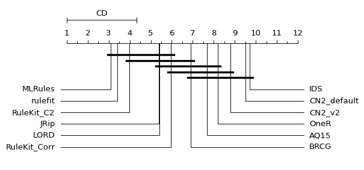

### Results for *UCI* datasets, for multi-class classification problems

Belowe is a CD diagram for the measure under study. The closer the value
is to ‘1’, the better the model is than the others.

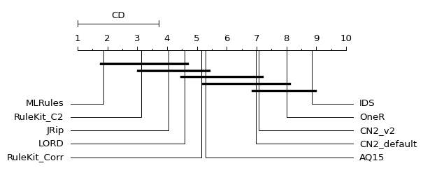

### Results for *BIG sets* datasets, for binary classification

Belowe is a CD diagram for the measure under study. The closer the value
is to ‘1’, the better the model is than the others.

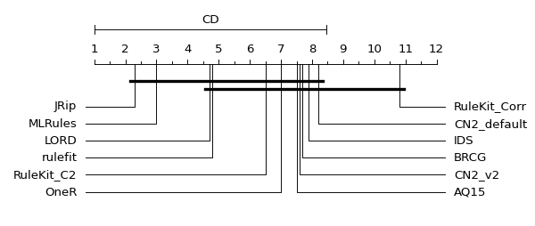

### Results for *BIG sets* datasets, for multi-class classification problems

Belowe is a CD diagram for the measure under study. The closer the value
is to ‘1’, the better the model is than the others.

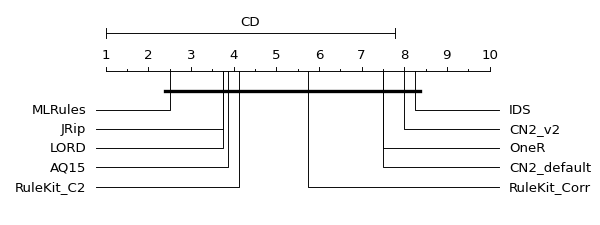

## Accuracy (ACC) of the prediction on the train dataset

The results for the *accuracy* measure determined on the train dataset
are shown below. The higher the value, the better.

### Results for *UCI* datasets, for binary classification

Belowe is a CD diagram for the measure under study. The closer the value
is to ‘1’, the better the model is than the others.

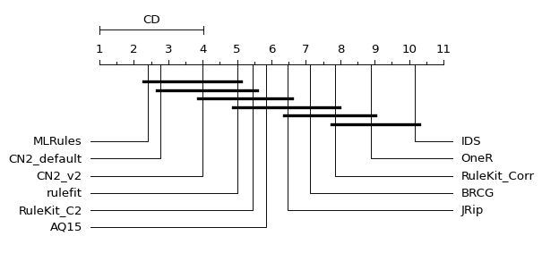

### Results for *UCI* datasets, for multi-class classification problems

Belowe is a CD diagram for the measure under study. The closer the value
is to ‘1’, the better the model is than the others.

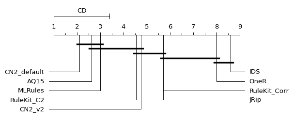

### Results for *BIG sets* datasets, for binary classification

Belowe is a CD diagram for the measure under study. The closer the value
is to ‘1’, the better the model is than the others.

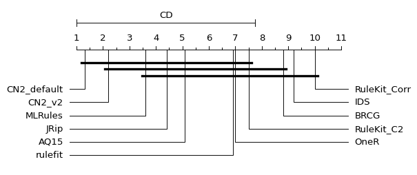

### Results for *BIG sets* datasets, for multi-class classification problems

Belowe is a CD diagram for the measure under study. The closer the value
is to ‘1’, the better the model is than the others.

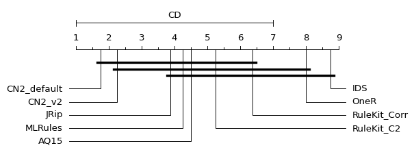

## Balanced accuracy (BAcc) on the test dataset

The results for the measure of *balanced accuracy* determined on the
test dataset are shown below. The higher the value, the better.

**Important note**: The LORD algorithm was not included in the balanced
accuracy rankings because its implementation does not return BACC metric
results.

### Results for *UCI* datasets, for binary classification

Belowe is a CD diagram for the measure under study. The closer the value
is to ‘1’, the better the model is than the others.

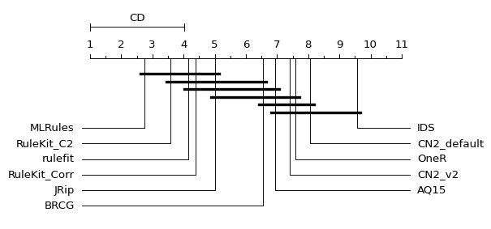

### Results for *UCI* datasets, for multi-class classification problems

Belowe is a CD diagram for the measure under study. The closer the value
is to ‘1’, the better the model is than the others.

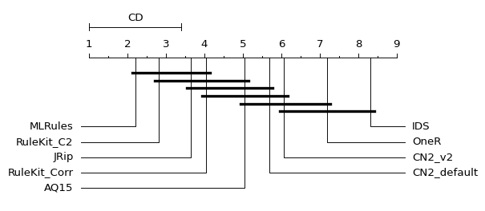

### Results for *BIG sets* datasets, for binary classification

Belowe is a CD diagram for the measure under study. The closer the value
is to ‘1’, the better the model is than the others.

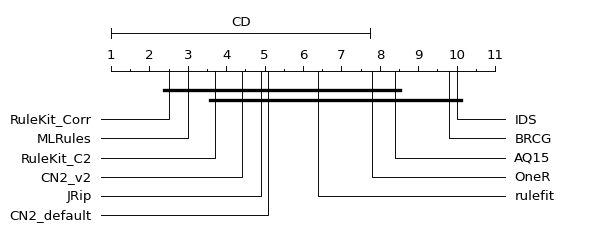

### Results for *BIG sets* datasets, for multi-class classification problems

Belowe is a CD diagram for the measure under study. The closer the value
is to ‘1’, the better the model is than the others.

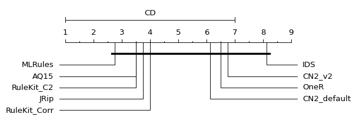

## Balanced accuracy (BAcc) on the train dataset

The results for the measure of *balanced accuracy* determined on the
training set are shown below. The higher the value, the better.

**Important note**: The LORD algorithm was not included in the balanced
accuracy rankings because its implementation does not return BACC metric
results.

### Results for *UCI* datasets, for binary classification

Belowe is a CD diagram for the measure under study. The closer the value
is to ‘1’, the better the model is than the others.

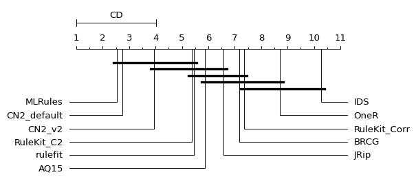

### Results for *UCI* datasets, for multi-class classification problems

Belowe is a CD diagram for the measure under study. The closer the value
is to ‘1’, the better the model is than the others.

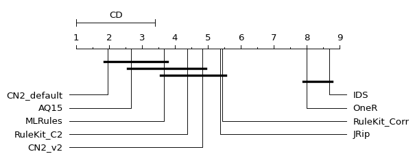

### Results for *BIG sets* datasets, for binary classification

Belowe is a CD diagram for the measure under study. The closer the value
is to ‘1’, the better the model is than the others.

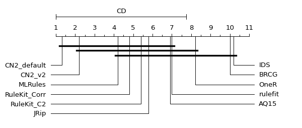

### Results for *BIG sets* datasets, for multi-class classification problems

Belowe is a CD diagram for the measure under study. The closer the value
is to ‘1’, the better the model is than the others.

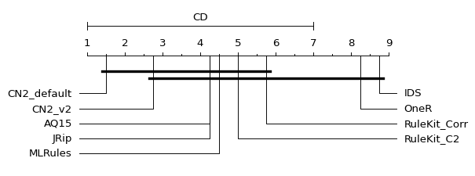

## Calculation time

The results for the time taken to perform the calculations are shown
below. The shorter the time, the better.

### Results for *UCI* datasets, for binary classification

Belowe is a CD diagram for the measure under study. The closer the value
is to ‘1’, the better the model is than the others.

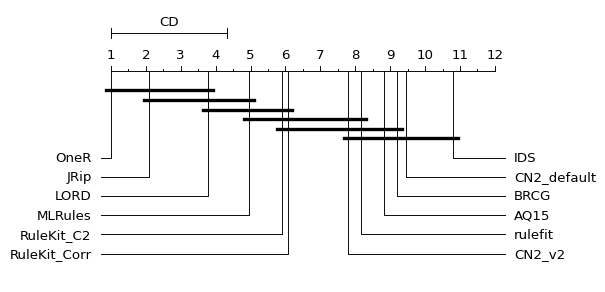

### Results for *UCI* datasets, for multi-class classification problems

Belowe is a CD diagram for the measure under study. The closer the value
is to ‘1’, the better the model is than the others.

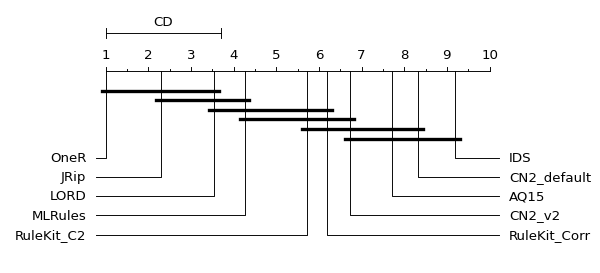

### Results for *BIG sets* datasets, for binary classification

Belowe is a CD diagram for the measure under study. The closer the value
is to ‘1’, the better the model is than the others.

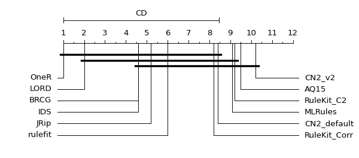

### Results for *BIG sets* datasets, for multi-class classification problems

Belowe is a CD diagram for the measure under study. The closer the value
is to ‘1’, the better the model is than the others.

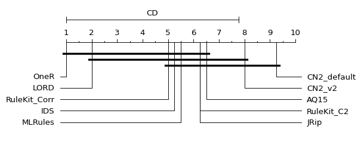

## Number of rules

The results for the number of rules generated by the method are shown
below. The smaller the value, the better.

### Results for *UCI* datasets, for binary classification

Belowe is a CD diagram for the measure under study. The closer the value
is to ‘1’, the better the model is than the others.

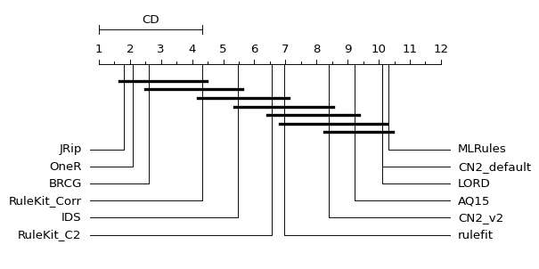

### Results for *UCI* datasets, for multi-class classification problems

Belowe is a CD diagram for the measure under study. The closer the value
is to ‘1’, the better the model is than the others.

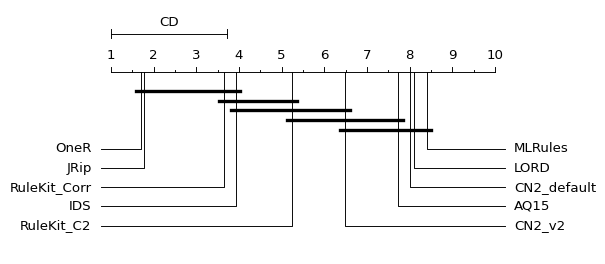

### Results for *BIG sets* datasets, for binary classification

Belowe is a CD diagram for the measure under study. The closer the value
is to ‘1’, the better the model is than the others.

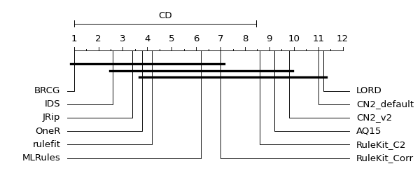

### Results for *BIG sets* datasets, for multi-class classification problems

Belowe is a CD diagram for the measure under study. The closer the value
is to ‘1’, the better the model is than the others.

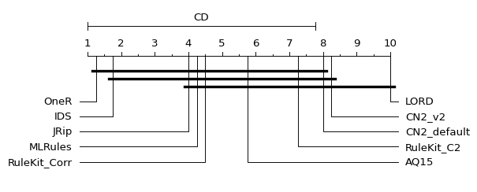

## Total number of conditions

The results for the total number of conditions generated by each method
are shown below. The smaller the value, the better.

### Results for *UCI* datasets, for binary classification

Belowe is a CD diagram for the measure under study. The closer the value
is to ‘1’, the better the model is than the others.

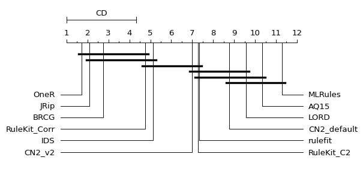

### Results for *UCI* datasets, for multi-class classification problems

Belowe is a CD diagram for the measure under study. The closer the value
is to ‘1’, the better the model is than the others.

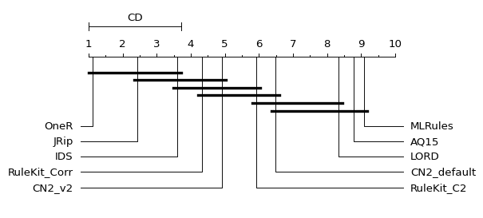

### Results for *BIG sets* datasets, for binary classification

Belowe is a CD diagram for the measure under study. The closer the value
is to ‘1’, the better the model is than the others.

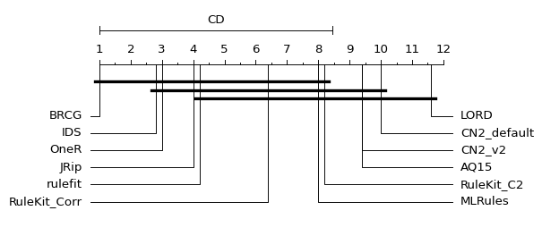

### Results for *BIG sets* datasets, for multi-class classification problems

Belowe is a CD diagram for the measure under study. The closer the value
is to ‘1’, the better the model is than the others.

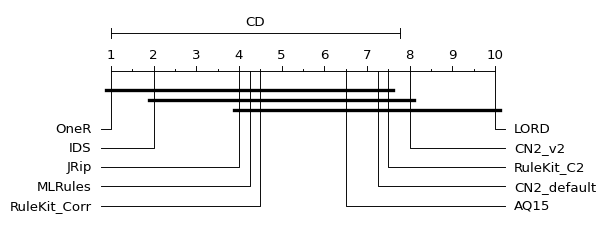

## Discussion

The motivation for the research was the comparison of known methods of
rule-based algorithms. We also wanted to check how our computational
kernel for rule induction – RuleKit – which is based on a sequential
covering induction algorithm, compares with well-known and established
methods. For this task, we have selected various algorithms, often
considered top-tier in academic literature, with available
implementations or executable programs for rule induction. The
experiments were performed based on 10-fold cross-validations.

In research, we included a range of approaches to rule induction. We
used covering algorithms: AQ15, CN2, JRip (JRip generates the list of
rules and not the ruleset); OneR that generates a set of rules that test
one particular attribute; MLRules that is an ensemble method in which a
single decision rule is treated as a base classifier in an ensemble;
RuleFit that is another rule-based ensemble method; LORD algorithm that
looks for a locally optimal rule for each example; and methods with
other approaches to rule induction: BRCG, which optimizes the entire
ruleset according to a given loss function, and IDS, which uses an
objective function that optimizes the accuracy and interpretability of
the rules at the same time.

For RuleKit, we tested many approaches (different parameter
configurations), but finally, we focused on default parameters with two
measures: C2 and Correlation. The Correlation (Corr) measure is
dedicated to knowledge discovery and computes the correlation
coefficient between the actual and predicted labels. The C2 measure is a
measure dedicated more to predictive models.

The use of two measures used in the RuleKit method was because we have
considered two main tasks connected with rule induction – knowledge
discovery and classification capabilities. From this objective, the set
of chosen methods for comparisons is also derived. The covering
techniques are more focused on knowledge discovery when ensemble methods
generate many rules but of very good accuracy. Each rule induction
algorithm can be focused on data mining and/or predictive purposes, and
these approaches should not be considered separately. In the research,
we wanted to focus on knowledge discovery and classification
capabilities at the same time.

In the research, we used, in most cases, default parameters of the
algorithms. The parameters used were described in detail in the section
“Algorithms and parameters” of this report. The comparisons were
performed on benchmark datasets that were divided into two groups:
smaller datasets, which are mainly from the UCI database, and more
extensive datasets (up to 300,000 rows in a dataset). It is worth noting
that in tasks of knowledge discovery, the analyzed datasets, in most
cases, are not very big because they are often adequately prepared by
scientists, doctors, or business analysts. The algorithms were also
compared separately for binary and multi-class classification problems,
because BRCG and RuleFit algorithms work only for binary classification
problems.

Let’s start with an analysis of predictive capabilities. We will focus
on Balanced accuracy (BAcc) calculated for test datasets because this
metric takes into account the disproportion of classes, and the results
are comparable for different datasets. Based on the CD diagrams obtained
for UCI datasets, we can see that the best results are obtained for
boosting the MLRules algorithm and RuleKit with the C2 measure. RuleKit
with the Correlation measure is a little further down the rankings, but
the results are also relatively high. The ensemble RuleFit algorithm and
covering JRip are also high in rankings. MLRules and RuleKit are also at
the top of the ranking for big datasets. In general, it can be seen that
the MLRules and RuleKit algorithms behave stably and achieve good
prediction results compared to other algorithms. It can also be seen
that among the coverage algorithms, it is RuleKit that gives the best
prediction results.

The LORD algorithm was not included in the balanced accuracy rankings
because its implementation does not output BACC metric results. Because
of this, we can look at the accuracy results for the test dataset, where
the LORD algorithm is included. In this comparison for smaller datasets,
LORD has worse results than MLRules and RuleKit using C2 measure, but it
is a little bit better than RuleKit with Correlation measure. For big
datasets, LORD obtains better results than RuleKit. Because of this, we
assume that the LORD algorithm is also an interesting algorithm to take
into account in further research, especially taking into account its
other advantages that will be presented.

It is also interesting to see that RuleKit obtains worse results for
accuracy metric, and it is quite good when focusing on balanced
accuracy. It is assumed that it happened because of the specificity of
big datasets and big imbalance of classes in big binary datasets.

The algorithms that exhibit relatively lower predictive abilities are
less interesting to us because good predictive capabilities are
essential for comparing rule-based predictive algorithms. For instance,
if an algorithm yields relatively poor prediction results, it doesn’t
matter much whether it creates a model in a shorter time or if the model
consists of a small number of conditions.

Now we can focus on another important metric which is time of
computation. In real-world scenarios of using rules-based methods, the
time in which we will obtain results is an important factor, especially
when a lot of experiments on many datasets need to be performed.

Comparing the execution time of calculations, the best results are
obtained for OneR algorithm. However, this method obtained relatively
poor balance accuracy results (it is a very simple algorithm), so the
computational time results of this algorithm are not so important for
us. For smaller datasets, JRip also obtained good results, but in the
case of predictions, it was worse than the RuleKit method. For bigger
datasets, LORD algorithm was right after OneR method, and this is
because of its ability to work in parallel. Looking at MLRules and
RuleKit, the most stable methods in case of predictive abilities, they
are close to each other in computational time ranking. As expected,
RuleKit using Correlation measure is faster than RuleKit using C2
measure. This is because the rules generated using the Correlation
measure tend to be more general and as we are employing a coverage
approach, this enables us to complete the calculations more quickly.

The next important factor is the number of rules. If the ruleset
contains many rules, it can be more accurate than other rule-based
models that contain fewer rules, but it can also be a complicated model
that is difficult to analyze.

It is important to note that MLRules cannot be compared in this category
because one of its parameters was a number of rules that was set to the
default value of 100 rules. We can see that for smaller datasets (UCI
datasets), MLRules obtains the worst rank in this comparison because it
generates a large number of rules compared to other methods. However,
for BIG datasets, some methods, mostly covering methods, generate even
more than 100 rules.

For UCI datasets, the best methods are OneR and JRip, which align with
expectations. OneR build methods based on one attribute, so the number
of rules is often small. JRip, by the fact that it builds a list, also
generates a few rules (in particular, all examples covered by the next
added rule are removed – including negative ones so it builds coverage
faster). However, OneR has small predictive abilities and JRip is
better, but still has worse abilities than other covering algorithm –
RuleKit. So, the small number of generated rules is not such a big asset
when they do not have high predictive abilities.

In this ranking, LORD is also one of the worst algorithms in the case of
a number of rules, especially for BIG datasets. This, however, is
probably because of the specifics of the algorithm. Probably, if perform
filtering of these rules to select only rules that cover examples, then
their number would significantly decrease, and the predictive ability
would not deteriorate - this is consistent with our intuitions and
results from the article [Data-driven adaptive selection of rule quality
measures for improving rule induction and filtration
algorithms](http://dx.doi.org/10.1080/03081079.2013.798901).

RuleKit for UCI datasets obtains really good results in terms of the
number of rules it generates. Considering its high predictive abilities,
it is a good indicator. However, RuleKit obtains more rules than most
other algorithms for bigger datasets, so the model won’t be easy to
analyze for these datasets. In this case, we could also use rule
filtering, which would probably improve RuleKit’s results, but it is not
our aim to use advanced post-processing in one algorithm if we cannot
use the same approach in others. We wanted to check the algorithms as
they are, so no additional post-processing was performed.

In the case of the used measure, RuleKit using Correlation obtains a
smaller number of rules than with the C2 measure, which is as expected.

We can see that for binary big datasets, the best algorithm is BRCG in
case of a number of rules. At first glance, it can be considered to have
obtained perfect results since it obtained a rank of 1 for each dataset
in this category. After analyzing the generated rules, it turned out
that for most binary big datasets, it generated only one rule each, and
in many cases, it was a general rule that had no elementary condition in
the premise. Considering this, the rank of 1 in terms of the number of
rules is not a significant factor here for BRCG algorithm.

# Comparison of RuleKit and MLRules

The tests compared the prediction quality of the MLRules method, which
returns 100 rules by default, and the RuleKit method, where the
`max-rule-count` parameter was set to 100. For the comparisons, the
RuleKit version using the `Correlation` and `C2` measure was selected
(results for the `RuleKit_mincov-5_measure-Correlation_maxNbRules-100`
and `RuleKit_mincov-5_measure-C2_maxNbRules-100` experiments were used).

A comparison will be made based on the *Balanced accuracy* measure
calculated on the test set. Missing results have been removed to
generate the boxplot.

## Results for *UCI* datasets

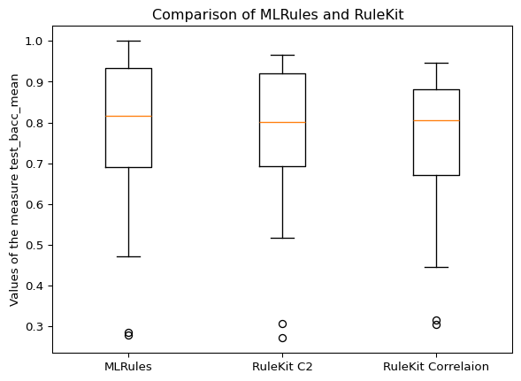

## Results for *BIG sets* datasets

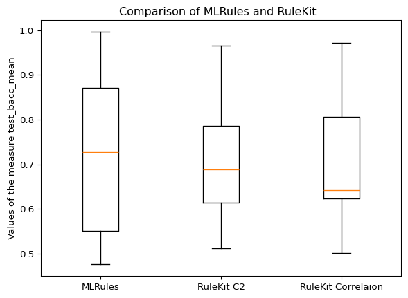

## Discussion

In this experiment we compared MLRules with 100 rules to RuleKit in
which the maximum number of rules was also set to 100 rules. The
comparison was made because MLRules obtained the best predictive results
in terms of Accuracy and Balanced accuracy. We wanted to check if
setting a maximum number of rules in RuleKit will change the results of
comparison.

The MLRules obtained better results than RuleKit, however the difference
is not very big, especially for smaller datasets. Also, the difference
between MLRules and RuleKit using C2 measure is not statistically
significant for smaller and big datasets, so we can say that these two
algorithms are similar to each other in case of predictive abilities
when both can generate similar number of rules.

# RuleKit - maximum number of rules

It was checked how the RuleKit results change depending on the indicated
value in the `max-rule-count` parameter. The following versions of the
RuleKit experiments were selected for comparison:

- `RuleKit_C2_maxNbRules-3`
  ==`RuleKit_mincov-5_measure-C2_maxNbRules-3` - max 3 rules.
- `RuleKit_C2_maxNbRules-5`
  ==`RuleKit_mincov-5_measure-C2_maxNbRules-5` - max 5 rules.
- `RuleKit_C2_maxNbRules-10` ==
  `RuleKit_mincov-5_measure-C2_maxNbRules-10` - max 10 rules.
- `RuleKit_C2_maxNbRules-100`
  ==`RuleKit_mincov-5_measure-C2_maxNbRules-100` - max 100 rules.
- `RuleKit_C2` == `RuleKit_mincov-5_measure-C2` - no limit on number of
  rules.

The comparison was made on the basis of the prediction accuracy score
(accuracy) on the test dataset and based on the calculation time.

## ACC on test dataset

Below are CD diagrams for the results of the accuracy obtained for test
datasets.

### UCI datasets

Friedman’s test result:

    The differences are statistically significant, we can reject the null hypothesis (p-value < 0.05).

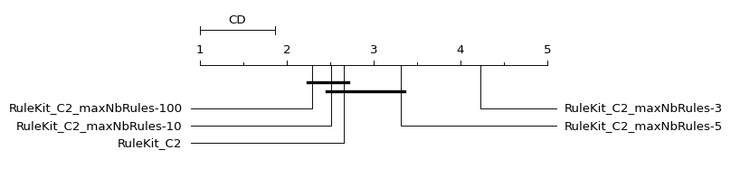

### BIG sets

Friedman’s test result:

    The differences are statistically significant, we can reject the null hypothesis (p-value < 0.05).

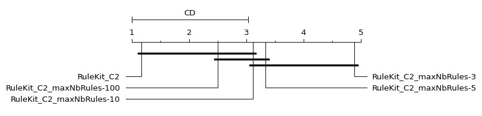

## BAcc on test dataset

Below are CD diagrams for the results of the balanced accuracy obtained
for test datasets.

### UCI datasets

Friedman’s test result:

    The differences are statistically significant, we can reject the null hypothesis (p-value < 0.05).

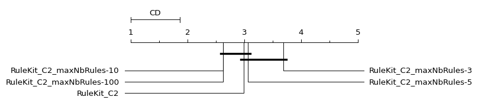

### BIG sets

Friedman’s test result:

    No statistically significant differences between algorithms (p-value >= 0.05).

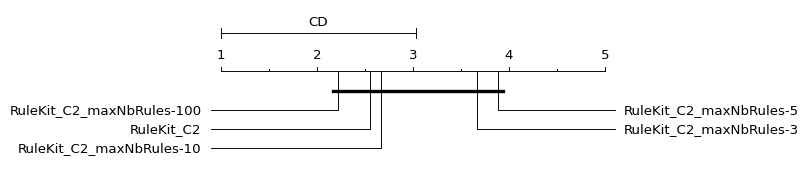

It can be seen that for *UCI* as well as *BIG sets*, the higher the
value of the maximum number of rules, the more accurate the results. The
worst results are obtained for the method where the limitation of
generating only 3 rules is given.

## Calculation time

Below are CD diagrams for calculation times.

### UCI datasets

Friedman’s test result:

    The differences are statistically significant, we can reject the null hypothesis (p-value < 0.05).

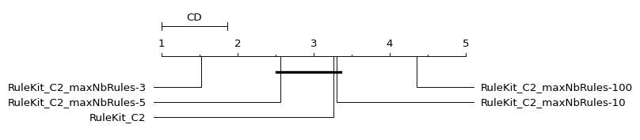

### BIG sets

Friedman’s test result:

    The differences are statistically significant, we can reject the null hypothesis (p-value < 0.05).

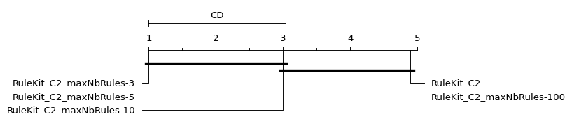

As anticipated, opposite results are obtained for calculation time
compared to the evaluation of the ACC measure. The fewer the number of
rules, the better the measure’s value, meaning that with a smaller
number of rules, the rule induction time decreases.

## Discussion

The last experiment was about the comparison between the different
settings of RuleKit with the C2 measure. Here we can see that an
arbitrary reduction in the number of rules can speed up computation time
without degrading the prediction results (for max number of 10 rules).
Smaller rulesets are known to reduce computation time but degrade
prediction significantly. The results of the experiments confirm that
utilizing this parameter can significantly impact the obtained results
based on the user’s priorities. Users may achieve results quicker if
time is crucial but with reduced accuracy. Alternatively, they may
obtain more accurate rules (more rules) at the expense of longer wait
times for results.

# Summary

The conclusions of the research are as follows:

- RuleKit is a good base solution for our RuleMiner platform. The basic
  form of the method is able to analyze data sets of various sizes,
  generating good rule classifiers composed of a comparable number of
  rules to other coverage methods.  

- The flaw of the RuleKit basic version is the computation time, which
  puts us in the middle of the compared algorithms but ahead of standard
  coverage algorithms.

- Controlling the number of generated rules allows the user to limit the
  computation time by obtaining a smaller number of rules without
  significant deterioration of predictive ability. For sets with a
  moderate number of examples (in our case UCI datasets) the limit of
  number of rules is 10, for large sets it is 100. Setting a smaller
  number of generated rules results in a reduction in the quality of the
  predictions.

- The RuleKit using C2 measure with maximum of 10 rules for moderate
  datasets and maximum of 100 rules for bigger datasets should be the
  starting point in data analyzes. Because of this, in RuleMiner
  platform these are the default setting for the user. Thanks to this,
  the user from the start obtains the good input parameters that
  generate good predictions in relatively shorter time.

- Because LORD and MLRules obtain good results in terms of computational
  time and predictive abilities, we plan:

  - Add in the RuleMiner platform an interface to upload rules generated
    by MLRules and LORD to check their precision and coverage. It will
    give the user the possibility to compare these results with RuleKit
    rules.
  - In the next version of RuleMiner, we will add the possibility to
    filter also sets of rules generated by the LORD algorithm (for
    RuleKit rules this is already available). We would also try to add
    filtering for MLRules, however this algorithm does not use weighted
    voting for classification so we would need to implement MLRules
    classification mechanism or add verification of MLRules voting
    technique.
